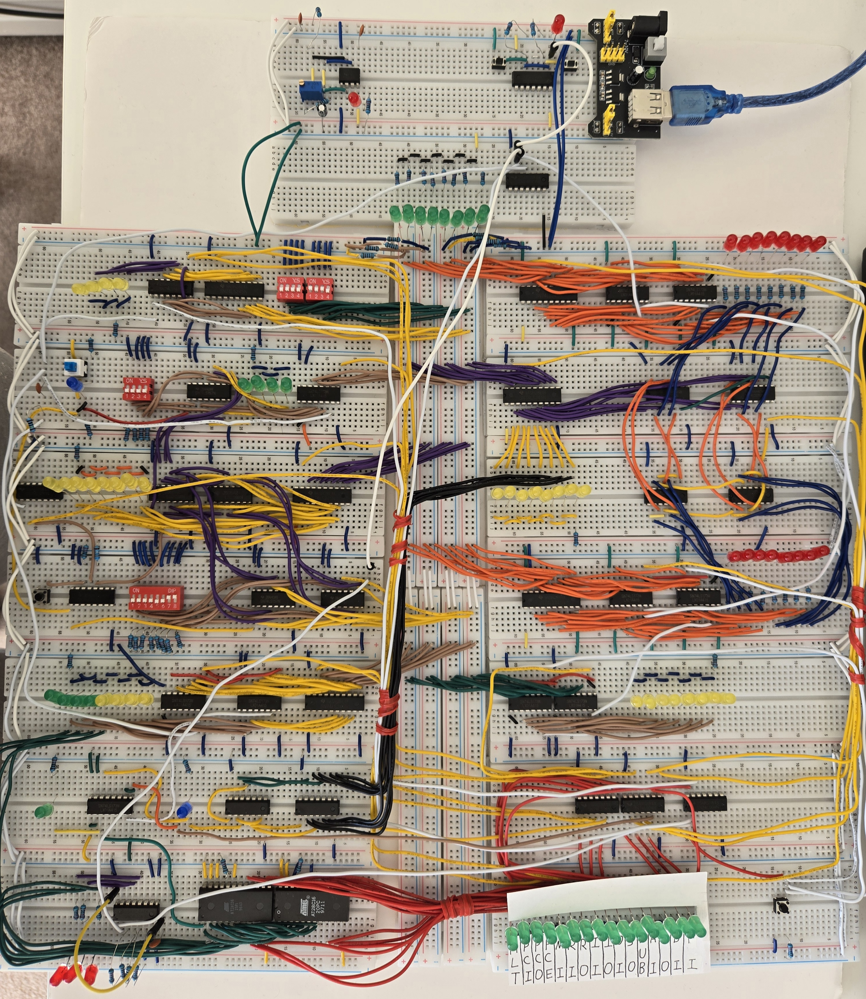
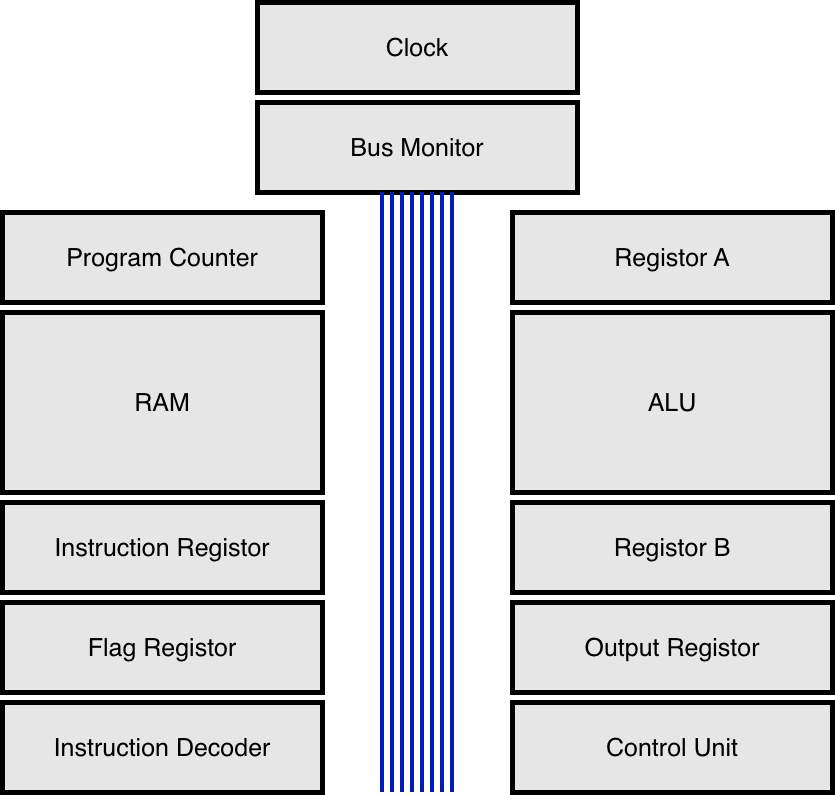

# 8-Bit CPU

An 8-bit breadboard CPU built from scratch using 74-series logic gates.

  

  
  
  

---

## Overview

This repository documents the design and physical construction of a custom 8-bit CPU prototype. Built from scratch on breadboards using 74-series logic integrated circuits (ICs) and manual point-to-point wiring, this capstone project demonstrates the foundational principles of computer architecture at the bare-metal level.

### Hardware Capabilities

The CPU operates on a central 8-bit bus based on the Von Neumann architecture. It features 16 bytes of random access memory (RAM) and is programmable via manual DIP switches. The system executes a custom instruction set capable of fundamental arithmetic operations including addition and subtraction. Additionally, the CPU integrates a flags register that enables conditional branching (jump instructions), making the architecture Turing complete.

### Acknowledgements

The theoretical foundation of this project was deeply inspired by the book <a href="https://books.google.ca/books/about/The_Elements_of_Computing_Systems.html?id=WP8uEAAAQBAJ&source=kp_book_description&redir_esc=y">_The Elements of Computing Systems_</a> and its companion course <a href="https://www.nand2tetris.org/">Nand to Tetris</a>. These resources provided the conceptual framework required to scale elemental logic gates into complex modules such as Arithmetic Logic Unit (ALU).

The physical breadboard implementation and overall structural approach were profoundly inspired by Ben Eater's <a href="https://youtu.be/HyznrdDSSGM?si=WMluEy4aOkz28rLG">8-bit computer video series</a>, supplemented by hardware design tutorials from <a href="https://www.bilibili.com/video/BV1VS7AztETt/?share_source=copy_web&vd_source=c48ed64ac46082e95058a657100d5dac">BiliBili</a>.

## Architecture

  

Due to the overall complexity of the build, this project utilized a modular design approach. The CPU's architecture was divided into distinct, manageable modules. This allowed each component to be built and tested individually before being integrated to form the complete system.

### Bus

The entire system communicates via an 8-bit central data bus constructed with breadboards. This bus serves as the primary backbone, facilitating data transmission between all modules. To provide real-time visual feedback, a dedicated bus monitor consisting of eight LEDs is connected directly to the bus lines, displaying the current binary data state. Additionally, a manual input module utilizing an 8-position DIP switch allows the user to manually inject data onto the bus for programming and debugging.

- [Bus Monitor Schematic](/Uploads/Schematics/Bus%20Monitor.png)

- [Manual Input Schematic](/Uploads/Schematics/Manual%20Input.png)

### Clock

The clock module emits an alternating high and low signal, driving the system to operate step-by-step. The design incorporates both an automatic mode for actual program execution and a manual mode for precise debugging. These two clock signals are routed through a selection switch to determine the active mode. The selected signal then feeds into an AND gate (utilizing a 74LS08 quad AND IC). The other input to this AND gate is the Halt (HLT) signal, which dictates whether the clock pulses are propagated to the rest of the system or suspended.

#### Manual Clock

The manual clock utilizes two NOR gates (from a 74LS02 quad NOR chip) configured as an SR (Set-Reset) latch. The output of each NOR gate cross-couples into one of the other gate's inputs, while the remaining inputs are toggled by a physical button to switch between high and low voltage. This latch configuration acts as a hardware debouncer, ensuring a clean, single pulse is generated for every button press. The output state is visually indicated by an LED connected in parallel with the output line.

#### Automatic Clock

The automatic clock is built around an NE555P timer IC and an RC (resistor-capacitor) circuit. The chip acts as a voltage detector and conditional switch, allowing current to charge the capacitor until it reaches a threshold of 3.3V, at which point it discharges down to a trigger voltage of 1.67V. This continuous cycle of charging and discharging generates the oscillating clock signal. The frequency of the clock is fully adjustable by varying the resistance (via a potentiometer) and the capacitance within the RC circuit. Operating on the global 5V supply, the automatic clock signal is also monitored by a dedicated LED.

- [Clock Schematic](/Uploads/Schematics/Clock.png)

### Program Counter

The program counter module keeps track of the execution sequence, dictating the memory address of the next instruction to be fetched. It is built around a 74LS161 4-bit synchronous binary counter IC, which inherently increments its stored value with each active clock pulse. The current 4-bit state of the counter is visually indicated by four LEDs connected directly to the chip's output pins. To assert this address onto the central bus, the module utilizes a 74LS245 bus transceiver acting as a tri-state buffer. This bus interaction is strictly regulated by the Program Counter Out (PCO) control signal.

- [Program Counter Schematic](/Uploads/Schematics/Program%20Counter.png)

### Random Access Memory (RAM)

The Random Access Memory (RAM) module provides 16 bytes of volatile data storage. Memory locations are accessed via a 4-bit address supplied by the Memory Address Register (MAR). The MAR is built around a 74LS173 register IC, which loads address data from the central bus when the Memory Address In (MI) control signal is asserted.

The actual data is stored in two 74LS219 RAM chips. Because each chip is a 16x4-bit memory unit, they are wired in parallel to form a complete 8-bit word for each of the 16 memory addresses. The data output from the RAM is routed through a 74LS245 bus transceiver, which buffers the output and only drives data onto the bus when the RAM Out (RO) control signal is active.

To allow the user to manually enter code into the computer, the module incorporates 74LS157 quad 2-to-1 multiplexers. These multiplexers route the RAM's address and data inputs from one of two sources: "Run Mode" (receiving addresses from the MAR and data from the bus) or "Program Mode" (receiving inputs from a 4-position DIP switch for addresses and an 8-position DIP switch for data). This mode selection is governed by a lockable DPDT toggle switch, with the current mode clearly indicated by a status LED.

Writing data to the RAM requires precise timing. In normal execution mode, the write pulse is generated using an RC (resistor-capacitor) edge-detection circuit combined with 74LS00 logic gates. This shapes the clock signal into a sharp, instantaneous pulse when the RAM In (RI) control signal is active, ensuring data is written cleanly. In manual programming mode, a dedicated pushbutton provides this write pulse. An additional 74LS157 multiplexer selects the appropriate write signal (automatic or manual) based on the current operating mode. Dedicated LEDs continuously display the current 4-bit address input and the 8-bit data output.

- [RAM Schematic](/Uploads/Schematics/RAM.png)

### Registers

The register modules provide temporary storage for 8-bit data. While each register in the CPU shares a core schematic based on the 74LS173 D-type flip-flop IC, they vary slightly in their specific functions, bus interactions, and control signals.

#### Register A&B

Registers A and B are identical storage units dedicated to holding the operands required for ALU calculations. Each register is constructed using two 4-bit 74LS173 ICs wired in parallel to form an 8-bit word. They are driven by the system clock and load data from the central bus when their respective control signals (A In AI or B In BI) are asserted. The current state of each register is continuously displayed via eight dedicated LEDs.

Both registers constantly feed their stored values directly into the ALU. However, only Register A acts as an accumulator. It utilizes a 74LS245 bus transceiver to output its data back onto the central bus when the A Out (AO) signal is active. Register B does not output to the bus.

- [Register A,B Schematic](/Uploads/Schematics/Register%20A.png)

#### Instruction Register

This module temporarily stores the current machine code instruction fetched from RAM. The core schematic is identical to Registers A and B, utilizing the Instruction In (II) control signal to load data from the bus. However, its output behavior is unique: the upper 4 bits (the opcode) are sent directly to the Control Unit for decoding, while the lower 4 bits (the operand/address) can be asserted back onto the bus using a 74LS245 transceiver governed by the Instruction Out (IO) signal.

- [Instruction Register Schematic](/Uploads/Schematics/Instruction%20Register.png)

#### Output Register

The output register captures and displays the final result of a program's execution. It consists solely of two 74LS173 ICs and eight status LEDs. Data is loaded into the register from the bus when the Output In (OI) signal is asserted. Because its sole purpose is user-facing display, this register does not possess a bus transceiver and cannot output data back onto the bus.

- [Output Register](/Uploads/Schematics/Output%20Register.png)

#### Flag Register

The Flags Register is the critical component that enables conditional branching (jump instructions), making the CPU Turing complete. It monitors the output of the ALU to determine specific states, primarily detecting if the result of an arithmetic operation is exactly zero.

This zero-detection logic is implemented by feeding the 8-bit result through a cascade of NOR gates (74LS02) and AND gates (74LS08). If all eight bits are 0, the circuit outputs a 1. This boolean flag is stored in a 74LS173 register on the next clock pulse when the Flags In (FI) control signal is asserted. The output of the Flags Register is continuously fed directly into the Control Unit, allowing it to dynamically alter the instruction execution path.

- [Flag Register Schematic](./Uploads/Schematics/Flag%20Register.png)

### Arithmetic Logic Unit (ALU)

The Arithmetic Logic Unit (ALU) performs fundamental arithmetic operations, specifically, addition and subtraction on the data provided by the registers.

The primary calculating engine is constructed using two 4-bit 74LS283 fast carry adders, wired in parallel to process 8-bit words. It continuously calculates the sum of the operands from Register A and Register B. The resulting 8-bit output is routed to a 74LS245 bus transceiver. This transceiver acts as a gatekeeper, only asserting the calculated result onto the central bus when the Sum Out (SO) control signal is active. The pre-buffered result is continuously displayed by a row of eight LEDs.

The ALU handles subtraction without requiring a subtraction IC. Instead, it utilizes Two's Complement arithmetic. In this system, the most significant bit (MSB) acts as the sign bit. A positive number is converted into its negative equivalent by inverting all of its bits (creating a one's complement) and then adding 1 to the least significant bit (LSB).

To achieve this physically, the data flowing from Register B into the adders is first routed through a series of 74LS86 quad XOR gates. When the Subtract (SUB) control signal is asserted, it acts as the second input to these XOR gates, inverting every bit from Register B. Meanwhile, this SUB signal is tied directly to the carry-in (Cin) pin of the first 74LS283 adder. This routing simultaneously flips the bits and adds the 1, completing the Two's Complement conversion and performing A + (-B).

- [ALU Schematic](/Uploads/Schematics/ALU.png)

### Instruction Decoder

The Instruction Decoder acts as the brain and translator of the CPU. It translates the raw machine code fetched from RAM into the precise sequence of active control signals needed to orchestrate every other module in the system.

This translation is achieved using two AT28C16 EEPROM chips. While each chip possesses 11 address lines capable of storing 2,048 bytes of data, this architecture only utilizes the lower 8 bits for addressing (pins A8 through A10 are tied directly to ground). The decoding process functions as a massive hardware look-up table. The input data forms a specific memory address, and the EEPROMs output a pre-programmed 16-bit control word (8 bits from each chip) dictated by the Instruction Set Architecture (ISA).

The 8-bit input address sent to the EEPROMs is dynamically constructed from three sources.

| EEPROM Address | Name | Description |
| :--: | :--: | :----- |
| A7 | Condition Flag | A 1-bit signal from the Flags Register, enabling conditional jump logic. |
| A3-A6 | Opcode | The 4-bit machine instruction provided directly by the Instruction Register. |
| A0-A2 | Micro-step | A 3-bit step signal generated by the integrated step counter. |

Because executing a single opcode requires multiple sequential steps (such as fetching, decoding, and executing), the module integrates a 74LS161 synchronous binary counter. Driven continuously by the system clock, this counter increments the 3-bit micro-step (Bits 0-2 of the EEPROM address), moving the CPU through the phases of an instruction cycle. The current step of the cycle is visually indicated by 3 LEDs.

- [Instruction Decoder Schematic](/Uploads/Schematics/Instruction%20Decoder.png)

### Control Unit

The Control Unit receives the 16-bit control word generated by the Instruction Decoder and distributes these signals to govern the behavior of every module in the CPU.

The EEPROMs in the Instruction Decoder output active-high signals, meaning a high voltage represents an "active" state. However, several integrated circuits within the CPU rely on active-low control pins, where a low voltage (ground or 0) is required to trigger an action. To accommodate this hardware requirement, the Control Unit utilizes 74LS04 hex inverters (NOT gates) to invert these specific signals before routing them to their respective modules.

The 16-bit control word is organized as follows. Signals that are active-low (requiring inversion) are denoted with an overline.

| Pin | Name | Description |
| :---: | :--- | :--- |
| $\overline{\text{HLT}}$ | Halt | Stops the system clock, suspending all CPU operations. |
| $\overline{\text{PCI}}$ | Program Counter In | Loads the current bus value into the Program Counter (used for Jump instructions). |
| $\overline{\text{PCO}}$ | Program Counter Out | Asserts the Program Counter's current address onto the bus. |
| ${\text{PCE}}$ | Program Counter Enable | Increments the Program Counter by 1 on the next clock pulse. |
| $\overline{\text{MI}}$ | Memory Address In | Loads the current bus value into the Memory Address Register (MAR). |
| ${\text{RI}}$ | RAM In | Writes the current bus value into the RAM at the address stored in the MAR. |
| $\overline{\text{RO}}$ | RAM Out | Asserts the contents of RAM (at the MAR address) onto the bus. |
| $\overline{\text{II}}$ | Instruction In | Loads the current bus value into the Instruction Register. |
| $\overline{\text{IO}}$ | Instruction Out | Asserts the lower 4 bits of the Instruction Register onto the bus. |
| $\overline{\text{OI}}$ | Output In | Loads the current bus value into the Output Register for display. |
| $\overline{\text{SO}}$ | Sum Out | Asserts the calculated result from the ALU onto the bus. |
| ${\text{SUB}}$ | Subtract | Sets the ALU to subtraction mode (initiates Two's Complement logic). |
| $\overline{\text{AI}}$ | A Register In | Loads the current bus value into Register A. |
| $\overline{\text{AO}}$ | A Register Out | Asserts the contents of Register A onto the bus. |
| $\overline{\text{BI}}$ | B Register In | Loads the current bus value into Register B. |
| ${\text{FI}}$ | Flag In | Loads the current ALU status flag (Zero) into the Flag Register. |

Every outgoing control line is monitored by a LED, providing a real-time visual representation of the active control word during execution. Moreover, this module features a manual Clear (CLR) circuit triggered by a physical pushbutton tied to power. This circuit distributes a global reset signal to all registers and counters, employing inverters to satisfy both active-high and active-low reset requirements across the different chips.

- [Control Unit Schematic](/Uploads/Schematics/Control%20Unit.png)

## Instruction Set Architecture (ISA)

Before a command can be executed, the CPU must fetch the instruction from memory. Therefore, the first two micro-steps (T0 and T1) of every instruction are identical. This sequence is known as the Fetch Cycle:

- **T0:** <kbd>PCO</kbd>, <kbd>MI</kbd> (The Program Counter asserts its address onto the bus, and the Memory Address Register reads it).

- **T1:** <kbd>RO</kbd>, <kbd>II</kbd>, <kbd>PCE</kbd> (RAM outputs the instruction to the bus, the Instruction Register stores it, and the Program Counter increments by 1).

Once the instruction is fetched, the Control Unit executes the specific micro-steps for that opcode starting at step T2.

<!-- (Note: In the microcode configuration, <kbd>SO</kbd> represents the ALU Sum Out, and <kbd>PCI</kbd> represents the Program Counter In).-->

<table>
  <thead>
    <tr>
      <th align="center">Opcode</th>
      <th align="left">Mnemonic</th>
      <th align="left">Name</th>
      <th align="left">Execution Micro-steps (T2 - T5)</th>
      <th align="left">Description</th>
    </tr>
  </thead>
  <tbody>
    <tr>
      <td align="center"><code>0000</code></td>
      <td><strong>NOP</strong></td>
      <td>No Operation</td>
      <td><strong>T2:</strong> (None)</td>
      <td>Does nothing. The CPU simply moves to the next instruction.</td>
    </tr>
    <tr>
      <td align="center"><code>0001</code></td>
      <td><strong>LDA</strong></td>
      <td>Load A</td>
      <td>
        <strong>T2:</strong> <kbd>MI</kbd>, <kbd>IO</kbd> 
        <strong>T3:</strong> <kbd>RO</kbd>, <kbd>AI</kbd>
      </td>
      <td>Loads the data from the specified RAM address into Register A.</td>
    </tr>
    <tr>
      <td align="center"><code>0010</code></td>
      <td><strong>ADDA</strong></td>
      <td>Add A</td>
      <td>
        <strong>T2:</strong> <kbd>MI</kbd>, <kbd>IO</kbd> 
        <strong>T3:</strong> <kbd>RO</kbd>, <kbd>BI</kbd> 
        <strong>T4:</strong> <kbd>SO</kbd>, <kbd>AI</kbd>
      </td>
      <td>Adds the data at the specified RAM address to Register A.</td>
    </tr>
    <tr>
      <td align="center"><code>0011</code></td>
      <td><strong>SUBA</strong></td>
      <td>Subtract A</td>
      <td>
        <strong>T2:</strong> <kbd>MI</kbd>, <kbd>IO</kbd> 
        <strong>T3:</strong> <kbd>RO</kbd>, <kbd>BI</kbd> 
        <strong>T4:</strong> <kbd>SO</kbd>, <kbd>SUB</kbd>, <kbd>AI</kbd>, <kbd>FI</kbd>
      </td>
      <td>Subtracts the data at the specified RAM address from Register A using Two's Complement. Updates flags.</td>
    </tr>
    <tr>
      <td align="center"><code>0100</code></td>
      <td><strong>STA</strong></td>
      <td>Store A</td>
      <td>
        <strong>T2:</strong> <kbd>MI</kbd>, <kbd>IO</kbd> 
        <strong>T3:</strong> <kbd>RI</kbd>, <kbd>AO</kbd>
      </td>
      <td>Stores the current value of Register A into the specified RAM address.</td>
    </tr>
    <tr>
      <td align="center"><code>0101</code></td>
      <td><strong>LDI</strong></td>
      <td>Load Immediate</td>
      <td>
        <strong>T2:</strong> <kbd>IO</kbd>, <kbd>AI</kbd>
      </td>
      <td>Loads the 4-bit operand directly into Register A, bypassing memory lookup.</td>
    </tr>
    <tr>
      <td align="center"><code>0110</code></td>
      <td><strong>JMP</strong></td>
      <td>Jump</td>
      <td>
        <strong>T2:</strong> <kbd>PCI</kbd>, <kbd>IO</kbd>
      </td>
      <td>Sets the Program Counter to the specified operand address.</td>
    </tr>
    <tr>
      <td align="center"><code>0111</code></td>
      <td><strong>JNZ</strong></td>
      <td>Jump Not Zero</td>
      <td>
        <em>If Zero Flag = 0:</em> <strong>T2:</strong> (None) 
        <em>If Zero Flag = 1:</em> <strong>T2:</strong> <kbd>PCI</kbd>, <kbd>IO</kbd>
      </td>
      <td>Conditional branch. Jumps to the specified address only if the Carry flag is active. Otherwise, acts as a NOP.</td>
    </tr>
    <tr>
      <td align="center"><code>1110</code></td>
      <td><strong>OUT</strong></td>
      <td>Output</td>
      <td>
        <strong>T2:</strong> <kbd>AO</kbd>, <kbd>OI</kbd>
      </td>
      <td>Asserts the value of Register A onto the bus and loads it into the Output Register for display.</td>
    </tr>
    <tr>
      <td align="center"><code>1111</code></td>
      <td><strong>HLT</strong></td>
      <td>Halt</td>
      <td>
        <strong>T2:</strong> <kbd>HLT</kbd>
      </td>
      <td>Halts the system clock, terminating program execution.</td>
    </tr>
  </tbody>
</table>

To physically write the ISA table into the AT28C16 EEPROMs, a custom hardware programmer module was constructed. While it is possible to program the chips manually, an Arduino Nano is utilized to automate the process, ensuring the data is written quickly and accurately.

Writing data to these EEPROMs requires simultaneously driving 11 address lines, 8 data lines, and a write-enable pin. Because the Arduino Nano lacks sufficient General-Purpose Input/Output (GPIO) pins to handle this concurrently, the module incorporates two 74HC595 8-bit shift registers to overcome the limitation. By using the shift registers, the Arduino only needs three pins (Data, Clock, and Latch) to transmit the address sequence serially. The 74HC595 chips temporarily store this serial input and output it in parallel to the EEPROM's address pins, expanding the Arduino's output capabilities.

During the programming phase, the two CPU EEPROMs are inserted into the programmer module one at a time. The Arduino executes a [custom script](/Uploads/EEPROM.ino) to rapidly write the microcode to the memory addresses. One chip is programmed with the upper 8 bits (the left side) of the 16-bit control word, and the other is programmed with the lower 8 bits (the right side).

- [Hardware Programmer Schematic](/Uploads/Schematics/EEPROM.png)

## Bill of Materials (BOM)

Building a physical CPU on breadboards requires a significant amount of logic components, as well as an powerful infrastructure to handle power distribution across the system. Below is a high-level summary of the primary components used in this build. For detailed breakdown, please refer to the [Full KiCad BOM (CSV)](/Uploads/BOM.csv).

### Integrated Circuits (ICs)

All logic in this CPU is implemented using the 74LS (Low-power Schottky) series of TTL integrated circuits, alongside dedicated memory chips.

<table>
  <thead>
    <tr>
      <th align="center">Quantity</th>
      <th align="left">Value</th>
      <th align="left">Description</th>
      <th align="left">Primary Modules</th>
    </tr>
  </thead>
  <tbody>
    <tr>
      <td align="center"><strong>10</strong></td>
      <td><code>74LS173</code></td>
      <td>4-bit D-Type Register</td>
      <td>Registers (A, B, Instruction, Output, Flag)</td>
    </tr>
    <tr>
      <td align="center"><strong>6</strong></td>
      <td><code>74LS245</code></td>
      <td>Octal Bus Transceiver</td>
      <td>Bus isolation for all registers</td>
    </tr>
    <tr>
      <td align="center"><strong>4</strong></td>
      <td><code>74LS157</code></td>
      <td>Quad 2-to-1 Multiplexer</td>
      <td>RAM manual programming logic</td>
    </tr>
    <tr>
      <td align="center"><strong>2</strong></td>
      <td><code>AT28C16</code></td>
      <td>2K x 8 EEPROM</td>
      <td>Instruction Decoder</td>
    </tr>
    <tr>
      <td align="center"><strong>3</strong></td>
      <td><code>74LS04</code></td>
      <td>Hex Inverter (NOT)</td>
      <td>Control Unit active-low inversion</td>
    </tr>
    <tr>
      <td align="center"><strong>2</strong></td>
      <td><code>74LS219</code></td>
      <td>16 x 4-bit RAM</td>
      <td>Main Memory</td>
    </tr>
    <tr>
      <td align="center"><strong>2</strong></td>
      <td><code>74LS283</code></td>
      <td>4-bit Binary Full Adder</td>
      <td>ALU arithmetic</td>
    </tr>
    <tr>
      <td align="center"><strong>2</strong></td>
      <td><code>74LS86</code></td>
      <td>Quad 2-Input XOR Gate</td>
      <td>ALU Two's Complement subtraction</td>
    </tr>
    <tr>
      <td align="center"><strong>2</strong></td>
      <td><code>74LS161</code></td>
      <td>4-bit Binary Counter</td>
      <td>Program Counter, Micro-step Counter</td>
    </tr>
    <tr>
      <td align="center"><strong>2</strong></td>
      <td><code>74LS02</code></td>
      <td>Quad 2-Input NOR Gate</td>
      <td>Manual Clock Debouncer, Zero Flag</td>
    </tr>
    <tr>
      <td align="center"><strong>2</strong></td>
      <td><code>74LS08</code></td>
      <td>Quad 2-Input AND Gate</td>
      <td>Clock selection, Zero Flag</td>
    </tr>
    <tr>
      <td align="center"><strong>2</strong></td>
      <td><code>74HC595</code></td>
      <td>8-bit Shift Register</td>
      <td>Hardware Programmer Module</td>
    </tr>
    <tr>
      <td align="center"><strong>1</strong></td>
      <td><code>74LS00</code></td>
      <td>Quad 2-Input NAND Gate</td>
      <td>RAM write pulse circuit</td>
    </tr>
    <tr>
      <td align="center"><strong>1</strong></td>
      <td><code>NE555P</code></td>
      <td>Precision Timer</td>
      <td>Automatic Clock generation</td>
    </tr>
  </tbody>
</table>

### Passive Components

<table>
  <thead>
    <tr>
      <th align="center">Quantity</th>
      <th align="left">Type</th>
      <th align="left">Description</th>
    </tr>
  </thead>
  <tbody>
    <tr>
      <td align="center"><strong>87</strong></td>
      <td>LED</td>
      <td>Status indicators for the bus, registers, and control signals.</td>
    </tr>
    <tr>
      <td align="center"><strong>67</strong></td>
      <td>220 Ω Resistor</td>
      <td>Current limiting resistors for LEDs.</td>
    </tr>
    <tr>
      <td align="center"><strong>12</strong></td>
      <td>1 KΩ Resistor</td>
      <td>Pull-up/pull-down resistors for logic gates.</td>
    </tr>
    <tr>
      <td align="center"><strong>6</strong></td>
      <td>0.1µF Capacitor</td>
      <td>Decoupling capacitors for IC power stability.</td>
    </tr>
    <tr>
      <td align="center"><strong>6</strong></td>
      <td>Switches</td>
      <td>Assorted DIP switches and pushbuttons for manual input and reset.</td>
    </tr>
    <tr>
      <td align="center"><strong>1</strong></td>
      <td>Arduino Nano</td>
      <td>Used to program the AT28C16 EEPROMs.</td>
    </tr>
  </tbody>
</table>

### Hardware Infrastructure

Because these are physical materials, they are not in the KiCad schematic but are crucial to the physical build.

- **Solderless Breadboards (14x MB-102)**: Using high-quality breadboards is essential to maintain reliable connections and prevent floating pins across the circuit.

- **Hookup Wire (10x 5m spools, 24 AWG)**: Solid core wire, color-coded to visually distinguish data lines, control signals, clock pulses, and power distribution.

- **Power Supply (MB102 Module)**: Provides a stable 5V output capable of handling the cumulative current draw from various 74LS series integrated circuits and status LEDs.

## Build and Testing Notes

Constructing a computer from discrete logic chips on 14 solderless breadboards presents a lot of physical and electrical challenges. Below are the construction guidelines and testing methodologies required to ensure system stability.

### Power Supply and Distribution

- **Voltage Configuration**: The system operates on 5V logic. If using an MB102 breadboard power module, verify that the onboard jumpers are set to 5V, not the default 3.3V.

- **Dedicated Power Source**: The cumulative current draw of the LEDs and 74LS series ICs is substantial. Do not power this circuit directly from a computer's USB port, as it risks drawing too much current and damaging the motherboard. Use a dedicated external wall adapter (e.g., 5V / 2.4A or higher).

- **Bridging Power Rails**: Standard full-size breadboards may have a physical break in the middle of their side power rails. It is important to bridge these gaps with jumper wires to ensure continuous power flow down the entire length of the board.

- **Common Ground and Rail Sharing**: When combining multiple breadboards, their power rails must be linked in a parallel configuration. Ensure all boards share a common ground (GND) and a common 5V line (VCC) to prevent ground loops or uneven voltage references.

- **Mitigating Voltage Drop**: Avoid daisy-chaining power sequentially through all 14 breadboards. Instead, run dedicated power lines directly from the main supply to different physical zones of the CPU to minimize voltage drop across the system.

### Hardware Logic Integrity

Do not leave input pins floating (unconnected). An unconnected input on a 74-series chip may picking up ambient electromagnetic noise and causing erratic logic oscillations.

Any unused input pin must be tied to a known electrical state. Depending on the chip's requirement, tie unused inputs to HIGH (5V) using a pull-up resistor (e.g., 1 KΩ), or to LOW (GND) using a pull-down resistor.

### Assembly and Testing Methodology

Before installation, verify the integrity of the breadboards. Occasionally, manufacturing defects can cause internal short circuits between the positive and negative rails.

Avoid using metal tweezers to forcefully push wires into the breadboard, as this can permanently deform the internal metal spring contacts. Use standard pre-crimped jumper wires to clear tight holes if necessary.

Due to the complexity of the shared bus, each module was built and tested in isolation. Modules were only connected to the central bus after verifying their individual read/write operations and control signal responses.

## Challenges

Building a CPU on breadboards exposes the circuit to physical and electrical realities that are often ignored in software simulations. Below are two major  challenges encountered and  resolved during the assembly process.

### Voltage Drop

During the initial testing of the register modules, the 74LS173 chips failed to load data from bus. A visual inspection of the wiring against the schematics revealed no obvious errors. However, checking the active circuit with a multimeter revealed that the high-state of the clock signal was peaking at less than 2.0 Volts. This fell below the minimum Input High Voltage threshold ($V_{IH}$) required to trigger TTL logic gates.

The cause was a status LED wired in series with the clock signal line. The forward voltage drop across the LED starved the downstream logic chips of the required operating voltage. To solve this, the status LED was re-routed to run in parallel with the output, allowing the clock signal wire to connect directly to the chips without obstruction. This restored the full 5V logic level, enabling the registers to capture data functionally.

### Double-Clocking

When integrating the Program Counter, the 74LS161 chip began presenting erratic behavior, frequently skipping steps (e.g., jumping from address 0 directly to 2 on a single clock pulse). After diagnostic testing, the issue was identified as electrical noise and ringing on the clock line. The highly sensitive synchronous counter interpreted a single noisy voltage shift as multiple distinct clock pulses.

This signal degradation was amplified by two factors: parasitic inductance caused by the long distance of the clock signal wires, and electromagnetic interference from adjacent logic chips switching states.

This issue was addressed on multiple aspects. The board layout was reorganized to place the clock  module closer to the counter which shortening the signal path, and looping wires were replaced with trimmed wire connections that sat flat against the board. Meanwhile, 0.1µF decoupling capacitors were placed near the affected chips to filter out noise. These hardware optimizations stabilized the clock edge.

## Future Improvements

While the current breadboard CPU is functional and Turing complete, the modular architecture allows for future expansions. Several planned hardware upgrades aim to enhance the system's usability and computational power:

### Decimal Output Display

Currently, the Output Register displays results in raw binary via 8 LEDs. To  improve readability, a multi-digit 7-segment decimal display module could be integrated. Similar to the Instruction Decoder, this would be implemented using additional AT28C16 EEPROMs configured as hardware look-up tables. The EEPROMs would take the 8-bit binary output as an address and output the segment-activation logic required to display the corresponding decimal numbers (0–255, or signed -128 to 127).

### Memory (RAM) Expansion

The current architecture limits the system to 16 bytes of RAM, dictated by the 4-bit Memory Address Register (MAR). Expanding the MAR to a full 8-bit register would increase the addressable memory space to 256 bytes. This upgrade would require replacing the existing 74LS219 RAM chips with a larger static RAM (SRAM) IC and routing a wider address bus, increasing the complexity and length of the programs the CPU can execute.

### Advanced ALU Architecture

The current Arithmetic Logic Unit is limited to basic addition and subtraction. A major planned overhaul involves redesigning the ALU based on the [_Nand to Tetris_ (Hack computer) architecture](https://b1391bd6-da3d-477d-8c01-38cdf774495a.filesusr.com/ugd/44046b_f0eaab042ba042dcb58f3e08b46bb4d7.pdf#page=7). By introducing six dedicated control bits (`zx`, `nx`, `zy`, `ny`, `f`, `no`), the ALU could  pre-process the $X$ and $Y$ inputs and post-process the output to perform up to 18 arithmetic and bitwise operations.

The proposed control signal logic would function as follows:

- **Pre-processing:** `zx` / `zy` (zero the input), `nx` / `ny` (bitwise NOT the input).

- **Core Function:** `f` (selects between integer Two's Complement addition or bitwise AND).

- **Post-processing:** `no` (bitwise NOT the final output).

This upgrade would allow the CPU to  compute bitwise AND (`&`), bitwise OR (`|`), logical negation, and increment/decrement operations without requiring multiple clock cycles. Additionally, a Negative flag (`ng`) would be integrated alongside the existing Zero (`zr`) and Carry flags to detect when the highest-order sign bit is active.
